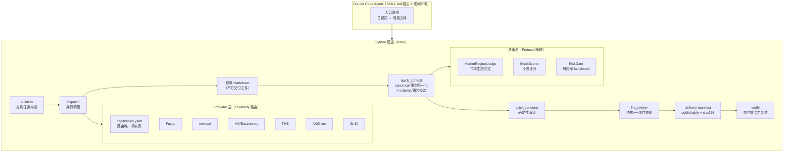
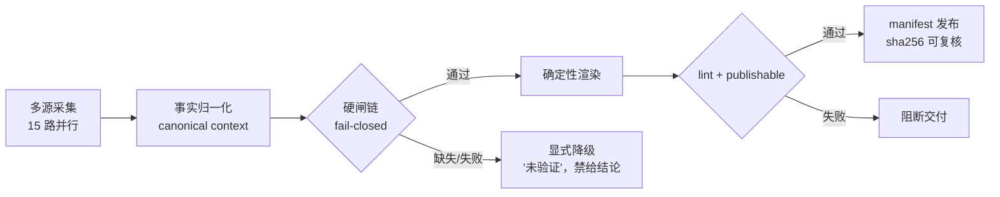
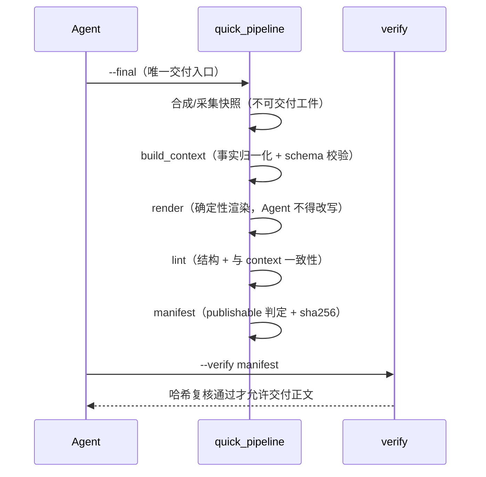

# A-Share Multi-Timeframe Trading Analysis Skill · 公开作品展示版

一个面向 A 股研究场景的 **Agent + 数据工程系统**：通过多源数据、确定性处理、
fail-closed 风控与可验证交付，降低 LLM 在金融分析中的幻觉与数据失真风险。

> **English:** A production-style A-share research pipeline built around
> deterministic processing, multi-source fallback, fail-closed validation,
> and agent-safe delivery.
>
> **这是一份求职作品集展示版**：展示 AI Agent 工程、金融数据工程、系统架构
> 与软件工程实践——**不是选股策略，也不是自动交易系统**。生产版本的选股
> 逻辑、评分权重、阈值、买卖触发条件与私有 prompt **不在本仓库公开**，
> 相关位置以 interface + mock/示例策略替代（见 [Mock 边界声明](#mock-边界声明)）。
> 仅供学习与技术交流，**不构成任何投资建议**。

## Highlights

| 亮点 | 一句话说明 |
|---|---|
| **Deterministic Pipeline** | 关键数字不由模型自由生成：由确定性管道产出、校验并渲染成报告 |
| **Multi-source Fallback** | 同一数据需求按能力自动路由主源+备源，主源故障自动降级且降级可见 |
| **Fail-closed 风控** | 数据缺失或核验不过 → 显式标注"未验证"、不给结论，绝不静默假数据 |
| **Verifiable Delivery** | 报告只能由确定性渲染器生成，交付前强制 sha256 哈希复核，篡改即检出 |
| **Agent / Skill 架构** | 声明式路由、渐进加载、多代理复核链（SKILL.md + AGENTS.md） |
| **Hermetic Test Suite** | 测试全局禁网闸：150+ 用例零网络可重复运行，GitHub Actions CI |

---

## 这是什么

一个 A 股多周期交易分析系统（Claude Code Skill 形态）：LLM Agent 按声明的
路由与硬闸规则驱动一套 Python 数据/交付管道，完成从多源行情采集、市场生态
归一化、确定性渲染到**可校验交付**的完整闭环。生产版本持续用于日常市场
分析与研究流程；公开版保留全部工程骨架，离线可跑。

解决的核心工程问题：

1. **LLM 输出不可信** → 关键数字不由模型自由生成：由确定性管道产出并校验，
   Agent 只能引用、不能改写（这套机制即后文的跨 Agent 交付契约 FINAL-001）；
2. **数据源单点故障** → capability 路由（同一数据需求自动路由到主源与备源）
   + 多源降级链 + 血缘审计（每个数字记录出处；同一家族的数据源互相印证
   不算独立验证）；
3. **风控纪律靠人守不住** → fail-closed（数据缺失不当作通过，核验失败只
   输出"未验证"）全链路化，绝不静默假数据；
4. **策略与工程耦合** → 决策层以 Protocol（接口契约）与管道解耦，可整体
   替换——本仓库本身就是"策略被替换成 mock 后系统依然完整可跑"的证明。

## 系统架构





## 技术栈

- **Python 3.12+**：pandas / pyarrow（parquet 日K底座）、requests、PyYAML
- **数据源**：问财 OpenAPI、东方财富妙想、同花顺 DataAPI、AKShare、
  金十资讯 MCP、腾讯/东财前复权K线 —— 全部经 netguard 白名单出网
- **Claude Code Skill**：SKILL.md 声明式路由 + 渐进加载 + 硬闸优先级
- **质量基建**：pytest 密闭套件（全局禁网闸）、ruff、mypy、GitHub Actions CI

## 核心模块

| 目录 | 内容 |
|---|---|
| `data/providers/` | Capability 路由的多源 provider 层：`capabilities.yaml` 是路由唯一事实源；`DataResult` 携带血缘（source/provider_family/as_of/status）；同族数据源对比**不算**独立验证 |
| `data/quick_*.py` | FINAL-001 跨 Agent 交付链：canonical context → 确定性渲染 → lint → manifest → 哈希复核；`publishable=false` 的正文禁止交付 |
| `data/strategy/` | 决策层 Protocol + 示例策略（生产实现私有） |
| `data/sources/` | 各数据商降级源（零配额优先）+ fail-closed 风险负面扫描 |
| `data/common/netguard.py` | 全局网络守卫：https-only + 域名白名单 + IP 边界（SSRF 防护）+ 重定向复检 |
| `data/tech/` | K线指标、前复权可用性、周期定位规则引擎（示例化） |
| `rules/ references/ systems/` | 规则/场景文档/心法层的**结构与格式示例**（生产内容私有） |
| `tests/` | 密闭测试：全局禁网闸 + 结构守护 + 交付契约端到端 |

## FINAL-001 交付契约（工程亮点）

所有 Agent（主代理与子代理）交付快速复盘必须走同一条管道：



- Agent 只可增加一句前言，**禁止**删改 required section、重组事实或引入
  artifact 之外的事实；
- 交付前 `--verify` 复核 sha256（TOCTOU 防护：篡改即检出，测试锁定）。

## 运行方式

```bash
pip install -r requirements-ci.txt

# ① 离线端到端 demo（零 key、零网络、零私人数据）
python demo/run_demo.py

# ② 与生产同一条命令面的交付入口
python data/quick_pipeline.py --final --snapshot output/demo/quick-snapshot-*.md --output-dir output/demo
python data/quick_pipeline.py --verify output/demo/delivery-manifest-*.json

# ③ 密闭测试套件
python -m pytest tests/ -q
```

详细环境变量与可选数据源配置见 [docs/INSTALL.md](docs/INSTALL.md)。

## Demo 示例输出

`python demo/run_demo.py`（固定种子合成数据，逐字节可复现）：

```text
[1/4] 合成快照 → quick-snapshot-20260911-201500.md
[2/4] canonical context → quick-context-20260911.json
[3/4] 确定性渲染 → quick-review-20260911.md
      manifest.publishable = true
[4/4] 交付前哈希复核：通过

----- 交付正文预览（前 12 行）-----
# 快速复盘 · 2026-09-11

> FINAL-001：正文由 canonical context 确定性生成；原始 snapshot 不可交付。

## ⚡ 快速复盘 TL;DR

**一句话结论**：主升（示例判定）；……
```

交付正文包含：TL;DR、四人裁决信号表、核心数据、聪明资金、连板梯队 +
断板名单、首板题材归类、主线确认、接力分析、持仓对照、趋势波段候选、
数据采集自检、整理追问 —— 每一节的数字都能在 canonical context JSON 里
找到对应字段（lint 强制）。

## 目录结构

```
stock-public/
├── SKILL.md               ← Skill 路由入口（展示版骨架）
├── AGENTS.md              ← 多代理协作约定（Sol/Luna 复核链）
├── rules/                 ← 规则层：格式与注册表示例（生产规则私有）
├── references/            ← 场景化渐进加载说明
├── systems/ tactics/ core/ knowledge/  ← 心法/战术/知识层示例与说明
├── data/
│   ├── round1_v2.py       ← 采集编排入口（公开版=精简+demo）
│   ├── builders.py / dispatch.py / iwencai_api.py  ← 任务构造与调度
│   ├── providers/         ← capability 路由多源 provider 层
│   ├── sources/           ← 降级源 + fail-closed 风险扫描 + 日K底座 stub
│   ├── quick_*.py         ← FINAL-001 交付链
│   ├── strategy/          ← 决策层 Protocol + 示例策略（mock）
│   ├── tech/              ← K线/前复权/周期引擎（示例化）
│   └── common/            ← netguard / calendar / paths 等底座
├── tests/                 ← 密闭测试（全局禁网闸）
├── docs/                  ← 架构文档 / 模块索引 / 公开审查报告
├── demo/                  ← 离线端到端演示（合成数据）
└── output/                ← 运行产物（gitignore，demo 可再生成）
```

完整模块级地图（含每文件 mock 标注）见 [docs/MODULE_INDEX.md](docs/MODULE_INDEX.md)；
数据商路由架构见 [docs/DATA_PROVIDER_ARCHITECTURE.md](docs/DATA_PROVIDER_ARCHITECTURE.md)。

## 测试方法

```bash
python -m pytest tests/ -q     # 152 tests，约 8s，零网络
```

密闭性由三层守卫保证（tests/conftest.py）：

1. 数据模式固定 legacy —— 不 spawn 真实 provider；
2. netguard 的 DNS 边界检查测试内直通 —— 白名单校验照常生效；
3. **全局禁网闸** —— 未打 `@pytest.mark.network` 标记的用例，任何进程内
   socket 外连立即 AssertionError（快速失败）。

结构守护测试（tests/test_public_structure.py）额外锁定：管道代码不得
import 已移除的私有策略模块、`docs/MODULE_INDEX.md` 与 data/ 实际文件
一致、全树无私人路径特征。

## Mock 边界声明

本仓库以下位置是 **mock / 示例 / 占位**，不代表生产实现：

| 位置 | 生产版 | 公开版 |
|---|---|---|
| `data/strategy/example_strategy.py` | 生态判定/评分/风控的私有实现 | 演示阈值（`SAMPLE_*`）的确定性示例 |
| `data/round1_v2.py` | 全量采集编排（约 2000 行）+ 完整 `_quick_eval` | 精简编排 + 兼容委托 |
| `data/builders.py` 尾盘/波段查询 | 私有选股画像条件 | 占位查询串 |
| `data/tech/cycle.py` | 十大周期行业阈值判据（私有知识库） | 虚构示例行业 |
| `data/quick_context.py` 判定常量 | 主线确认/接力的生产阈值 | `SAMPLE_*` 演示常量 |
| `data/review_hooks.py` | 五收尾钩子编排 | 空骨架（签名兼容） |
| `data/sources/market_dump.py` | 全市场日K parquet 底座 | stub（恒"不可用"降级） |
| `data/case_lib.py` | 形态案例库（策略知识） | 仅保留腾讯日K取数函数 |
| `rules/ systems/ references/` | 生产规则/心法/场景文档 | 格式与结构示例 |

除此之外的管道代码（provider 层、交付链、netguard、测试基建）与生产仓库同构。

## 设计思路

- **确定性优先**：凡能落成代码的判定绝不交给模型自由发挥；模型负责解释与
  交互，管道负责事实与交付。
- **Fail-closed 全链路**：数据缺失不是 0 而是显式 `unverified`；风险核验
  不过就不给结论；交付闸不过就不发布。
- **血缘与可审计**：每个数字可回溯到数据源、时间戳与归一化路径；同族数据源
  的相互印证被显式标注为非独立验证。
- **策略可插拔**：决策层 Protocol 化 —— 本仓库本身就是"策略被替换成 mock
  后系统依然完整可跑"的证明。

## License

[MIT](LICENSE)（仓库内示例代码与文档；不含任何交易策略授权）。
